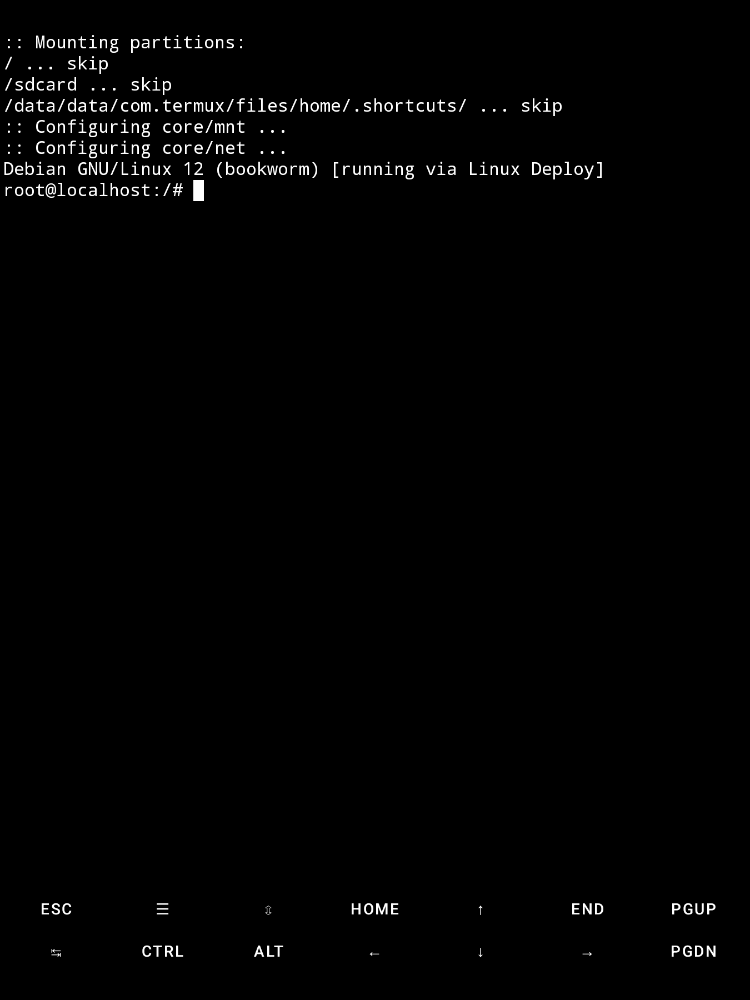

## !

You know how [Termux](https://github.com/termux/termux-app/releases) runs its own chroot inside your _rooted Android devices_? Why need it if you'd also have a [_Linux Deploy_](https://github.com/lateautumn233/Linuxdeploy-Pro/releases) deployment deployed? This project automatically redirects my Termux console to my Linux Deploy installation in all cases.

---

## ?

Here's what I do to deploy my minified environment to my phone:

0. Ensure that the _Mount Namespace Mode_ in Magisk is set to _Global_.

1. Create a tar file from the repo's `./usr` directory (or download the [`termux_data.tar`](./termux_data.tar) that's provided):

```sh
tar -cf termux_data.tar usr
```

2. Push the file to the Android device:

```sh
adb push termux_data.tar /sdcard/Download
```

3. Open a root shell on the Android device:

```sh
adb shell
```

```sh
su
```

4. Then replace the files in Termux's app storage under `su` mode:

```sh
cd /data/data/com.termux/files
rm -rf *
tar -xf /sdcard/Download/termux_data.tar
chmod -R 777 .
```

5. Don't forget to restart Termux.
