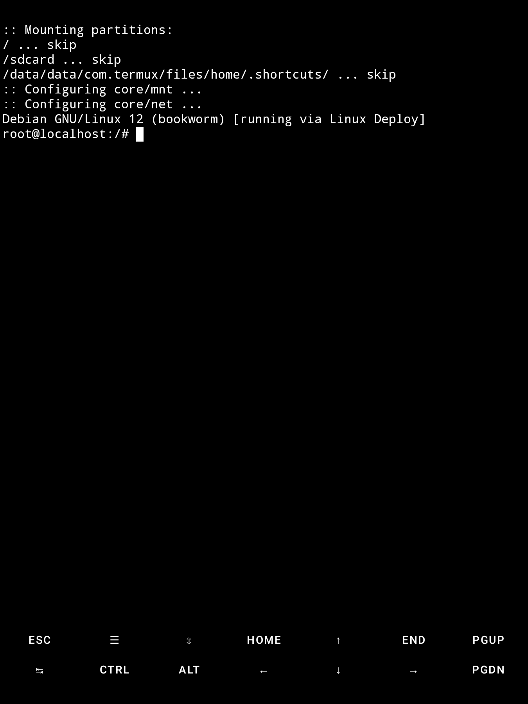

## !

You know how [Termux](https://github.com/termux/termux-app/releases) runs its own chroot inside your _rooted Android devices_? Why need it if you'd also have a [_Linux Deploy_](https://github.com/lateautumn233/Linuxdeploy-Pro/releases) deployment deployed? This project automatically redirects my Termux console to my Linux Deploy installation in all cases.

## ?

Here's what I do to deploy my minified environment to my phone:

0. Ensure that the _Mount Namespace Mode_ in Magisk is set to _Global_.

1. Download the [`termux_data.tar`](https://github.com/Windows81/Termux-to-Linux-Deploy-Pipe/releases/download/latest/termux_data.tar) that's provided:

```sh
cd /sdcard/Download
wget https://github.com/Windows81/Termux-to-Linux-Deploy-Pipe/releases/latest/download/termux_data.tar
```

2. Replace the files in Termux's app storage under `su` mode:

```sh
rm -rf /data/data/com.termux/files/usr && cd /data/data/com.termux/files && tar -xf /sdcard/Download/termux_data.tar && chmod -R 777 .
```

3. Don't forget to restart Termux.

## ...



```

```
